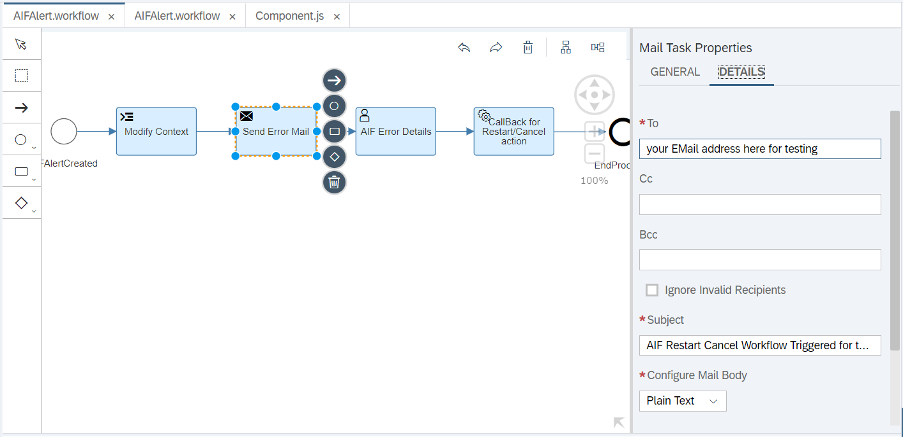
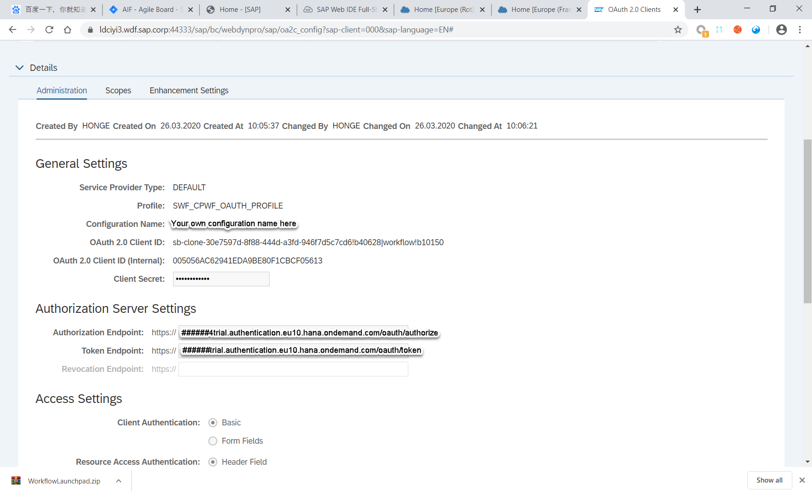
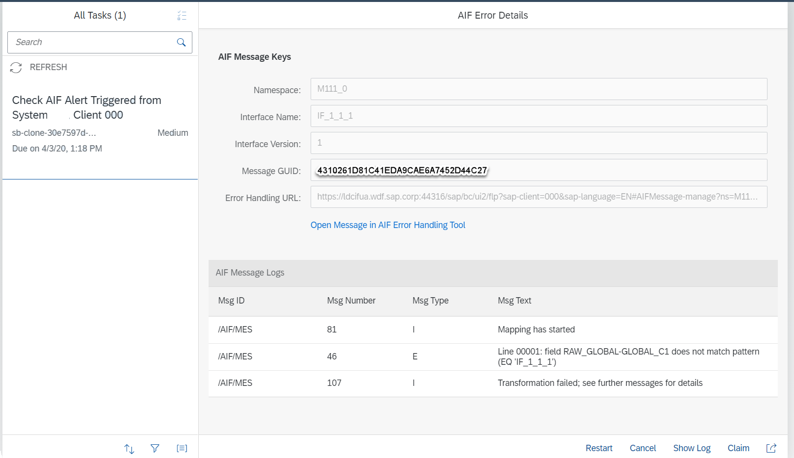

# SAP Application Interface Framework and SAP Workflow Service Integration Sample
The sample project of thhe SAP Application Interface Framework (AIF) SAP Workflow service integration sample project can be used as reference content. Users can download and import the content of this project to their tenant to understand and learn how to integrate SAP Applcation Interface Framework and SAP Workflow service.  

[SAP Workflow service](https://help.sap.com/viewer/product/WORKFLOW_SERVICE/Cloud/en-US) allows you to build, run, and manage workflows, from simple approvals to end-to-end processes that can span across different organizations and applications. With an inbox application and custom-built user interfaces, you involve end users into business processes for decision making and data entry.

[SAP Application Interface Framework (AIF)](https://www.sap.com/products/application-interface-mgmt.html) allows you to implement, monitor, and manage application interfaces from a central location to simplify interface handling across your system landscape.

This SAP Application Interface Framework SAP Workflow service integration sample project contains a workflow application to demonstrate the usage of SAP Workflow service in the context of integrating SAP Application Interface Framework with SAP Workflow service. **It's only intended to be used as a reference content for the development of SAP Application Interface Framework and SAP Workflow service integration applications, not for production usage directly.**

# Scenario
When an error occurs in SAP Application Interface Framework during message processing in SAP S/4HANA, an alert is created to inform the business user.   
In addition to this alert, a workflow instance in SAP Workflow service can also be created and assigned to a specific user of a group.   
Within the processing in SAP Workflow service, the users are able to see the error logs of the SAP Application Interface Framework message, and restart or cancel it from the workflow.  

# Requirements
To follow this setup guide, you need the following: 
* SAP Business Technology Platform tenant - If you don't have one, you could get your hands on a [free trial account](https://www.sap.com/products/free-trials.html)
* Active subscription to [SAP Workflow service](https://www.sap.com/developer/tutorials/cp-workflow-getting-started.html) in your SAP BTP tenant
* [Enable the Workflow Editor feature](https://help.sap.com/viewer/f85276c5069a429fa37d1cd352785c25/Cloud/en-US/07adfa6d819a42e9966e63de1a654de4.html) in SAP Web IDE Full-Stack  
* Active subscription to SAP Connectivity service, SAP Destination service, SAP Cloud Portal service and SAP WebIDE Full-Stack in your SAP BTP tenant
* SAP S/4HANA system with AIF interface

# Setup Guide
## Setup in SAP Business Technology Platform (SAP BTP)
### Create SAP Workflow Service Instance
Following the [help documentation](https://help.sap.com/viewer/65de2977205c403bbc107264b8eccf4b/Cloud/en-US/5516f912bae84922ba8c8eb46b8bfce5.html), create a new SAP Workflow service instance with the following parameters:

	Instance Name: AIF_Alert_Management
	Parameters   : 
	{
	    "authorities": [
		"WORKFLOW_INSTANCE_START",
		"WORKFLOW_DEFINITION_GET",
		"WORKFLOW_INSTANCE_GET",
		"WORKFLOW_INSTANCES_UPDATE",
		"WORKFLOW_INSTANCE_CANCEL",
		"WORKFLOW_INSTANCE_GET_ERROR_MESSAGES",
		"WORKFLOW_INSTANCE_GET_CONTEXT",
		"WORKFLOW_INSTANCE_GET_EXECUTION_LOGS",
		"MESSAGE_SEND"
	    ]
	}

  

### Create Role Collection
Following the [help documentation](https://help.sap.com/viewer/65de2977205c403bbc107264b8eccf4b/Cloud/en-US/d5f1612d8230448bb6c02a7d9c8ac0d1.html), create a new role collection with the following parameters:  

	Role Collection Name: AIF_WF_role_collection
	Description         : AIF Message Monitor

After the role collection has been created, select the role name in the role collection list, then select “Add Role” and add the following roles list:

	WorkflowAdmin
	WorkflowContextAdmin
	WorkflowContextViewer
	WorkflowDeveloper
	WorkflowInitiator
	WorkflowMessageSender
	WorkflowParticipant
	WorkflowTenantOperator
	WorkflowViewer
	
 

  

### Assign Role Collection
After creating the role collection, follow this [help documentation](https://help.sap.com/viewer/65de2977205c403bbc107264b8eccf4b/Cloud/en-US/9e1bf57130ef466e8017eab298b40e5e.html) to assign the users who will monitor the workflow instances to the new role collection.

### Setup Cloud Connector
Following the [help documentation](https://help.sap.com/viewer/cca91383641e40ffbe03bdc78f00f681/Cloud/en-US/3f974eae3cba4dafa274ec59f69daba6.html), set up a new connector to your SAP BTP subaccount.  
Select "Cloud to On-Premise" and add a new “Mapping Virtual to Internal ABAP System”:  

	Example:
	Field 		Value
	Back-end Type:	ABAP System
	Protocol:	HTTPS
	Internal Host:	######.wdf.sap.corp 
	Internal Port:	443##
	Virtual Host:	######.wdf.sap.corp 
	Virtual Port:	443##
	Principal Type: 	None
	Host in Request Header:	Use Virtual Host
To add a new resource, select “Add”. When the page “Add Resource” pops up, fill the fields with the following values:  
	
	URL Path:	/
	Active:		true
	Access Policy:	Path and all sub-paths
Save it and check the availability of the connection.

### Create Destination for Email Service
Following the [help documentation](https://help.sap.com/viewer/e157c391253b4ecd93647bf232d18a83/Cloud/en-US/45220d841c704a4c8ac78618207ee103.html), create a new email destination with the following parameters:  

	Destination Name: bpmworkflowruntime_mail
	Parameters      :   
		mail.user=<your email user> 
		mail.password=<your email password>
		mail.smtp.host=<you email provider’s host>
		mail.smtp.port=<your mail server port>
		mail.transport.protocol=smtp
		mail.smtp.starttls.required=true
		mail.smtp.starttls.enable=true
		mail.smtp.auth=true
		mail.smtp.from=<your email address>
		mail.smtp.ssl.checkserveridentity=true
		mail.bpm.send.disabled=false

    

### Create Destination for Workfow to Callback to ABAP System

Save the following destination, as it will be used in the workflow definition:  

	Example:
	Name: 		 YI3_000
	Type:            HTTP
	Url: 	         This the URL from SCC virtual host and port, e.g. https://ldci###.wdf.sap.corp:443##
	Proxy type:      OnPremise
	Authentication:  <BasicAuthentication, according your environment>
	User:            <your test user in abap system>
	Password:        <your test user password>
	Parameters: 
	sap-client:      <your abap system client> example: 000
	WebIDEEnabled:    true
	WebIDESystem:     <you abap system id>, example: YI3
	WebIDEUsage:      odata_gen,odata_abap,dev_abap,ui5_execute_abap,bsp_execute_abap
	

### Download and Deploy Workflow Monitoring LaunchPad
Download or clone the following content from the Git repository:  

	aif-scp-workflow-integration-sample --> WorkflowLaunchpad.zip

Following the [help documentation](https://help.sap.com/viewer/825270ffffe74d9f988a0f0066ad59f0/CF/en-US/51321a804b1a4935b0ab7255447f5f84.html), login to SAP Web IDE Full-Stack and import the "WorkflowLaunchpad.zip" into the workspace.
Once the import has finished successfully, [build and deploy](https://help.sap.com/viewer/825270ffffe74d9f988a0f0066ad59f0/CF/en-US/1b0a7a0938944c7fac978d4b8e23a63f.html) the project to SAP BTP.

After the successful deployment, open your SAP BTP cockpit and navigate to the space you deployed the project to.  
Select the menu item “Application”. In the list of applications, there should be an application named “WorkflowLaunchpad_appRouter”: 
 
 

    

#### Find the Monitoring Launchpad URL
Select the application "WorkflowLaunchpad_appRouter"; the application details will be displayed in another browser tab or window.  
In the section “Application Routes”, you can find the URL of the Workflow Monitor Launchpad. 
Note this URL down.  

 

    

### Download and Deploy Workflow AIFAlertManagement
Download or clone the following content from Git repository:  

	aif-scp-workflow-integration-sample --> AIFAlertManagement_WithRestartandCancel.zip

Following the [help documentation](https://help.sap.com/viewer/825270ffffe74d9f988a0f0066ad59f0/CF/en-US/51321a804b1a4935b0ab7255447f5f84.html), login to SAP Web IDE Full-Stack and import the "AIFAlertManagement_WithRestartandCancel.zip" into the workspace.  
Once the import has finished successfully, expand the “AIFAlertWorkflow” folder, then expand the “Workflows” subfolder and double-click the file “AIFAlert.workflow”. The workflow definition opens in the editor.  
Select the “Send Error Mail” task and then switch to the “Details” tab in the properties section on the right. In the “To” field, enter the email addresses that should receive the alert email for the workflow instance. Save your changes.  

 

    

[Build and deploy](https://help.sap.com/viewer/825270ffffe74d9f988a0f0066ad59f0/CF/en-US/1b0a7a0938944c7fac978d4b8e23a63f.html) the project to SAP BTP.

#### Find the Service Key Data
After the successful deployment, open your SAP BTP cockpit and navigate to the space you deployed the project to.  
Select the menu item “Services” > “Service Instances”, then select the application “AIF_Alert_Management” from the list of applications. Its details are displayed on a new page.  
In the bottom section, a JSON file is displayed. Find the following information in this JSON:  

	clientid
	clientsecret
	url
	
The following is a sample service key:

 

    

## Setup in SAP S/4HANA System
Log on to your SAP S/4HANA system.
### Setup of the RFC Destinations
Open transaction "SM59" and create a new RFC destination with connection type “G”.  
In the “Technical Settings” section, maintain the following parameters:  

	Targ       : api.workflow-sap.cfapps.eu10.hana.ondemand.com (might be different based on your SAP BTP account)
	Path Prefix: /workflow-service
Depending on your system security requirements, in the “Logon & Security” section, activate or deactivate the “SSL” of “Status of secure Protocol”.	
The following is a sample destination:     

 

    

Open transaction “SBGRFCCONF” and create a new bgRFC inbound destination “BC_CPWF_INBOUND_DEST” as below:    

 

 

### Setup of the oAuth2 Client Profile Configuration
Open transaction “OA2C_CONFIG”, which opens the Web Dynpro application in your default browser.   
Create a new configuration named “SWF_CPWF_OAUTH_####” with profile “SWF_CPWF_OAUTH_PROFILE”.    
For the profile configuration, enter the following parameters:   

	OAuth 2.0 Client ID           : the client id you got previously
	Client Secret                 : the client secret you got previously
	Authorization Endpoint        : the url you got previously + /oauth/authorize
	Token Endpoint                : the url you got previously + /oauth/token
	Client Authentication         : Basic
	Resource Access Authentication: Header Field
	Selected Grant Type           : Client Credentials 
	
Your setting should look like in the following screenshot:  

 

### Link SAP Application Interface Framework with SAP Workflow Service
Open transaction “SEGW”. Make sure the service “SWF_CPWF_NOTIFICATION_SRV” was registered for testing an ABAP system.  

Open transaction “SM30”. In the input field “Table/View”, enter the value “V_SWF_CPWF_CNSMR” and select “Maintain”.  
If there is no entry for the Consumer Type “AIF_ALERT” in the data maintenance overview screen, create a new entry. Enter the following values:  

	Consumer: AIF_ALERT  
	Consumer text Description:  AIF Testing  
Save your entries.  

Open transaction “SM30”. In the input field “Table/View”, enter the value “V_SWF_CPWF_CNSMA” and selectc “Maintain”.  

	Consumer: AIF_ALERT  
	Active:  X  
Save your entries.  

Open transaction “SM30”. In the input field “Table/View”, enter the value “V_SWF_CPWF_DEST” and select “Maintain”.  
If there is no entry for the Consumer Type “AIF_ALERT” in the data maintenance overview screen, create a new entry. Enter the following values:    

	Destination  : the RFC destination (type “G”) you created previously
	Configuration: the OAuth configuration name you created previously

Your details should look like this:  

 

### Link SAP Application Interface Framework Interface with Workflow Definition
Open transaction “/AIF/CUST” and go to “SAP Application Interface Framework” -> “System Configuration-> “SAP Workflow Service Integration” -> “Settings for Integration of SAP Workflow Service”.  
In the data maintenance overview screen, create a new entry for your SAP Application Interface Framework interface.     
Enter the following value:    

	Ext Workflow ID: aifalert
	
It should look like this:   

 

# Trigger SAP Application Interface Framework Message and Workflow Instance
## Send Test Data
Log on to your SAP S/4HANA system.
Send the SAP Application Interface Framework message with error logs for the interface you configured previously.

# Monitoring at SAP BTP	
Open your web browser and log on to the Monitoring Launchpad URL you got previously.    
In the Fiori Launchpad, select “My Inbox” to display the user task application.    
Select the list item to display the AIF message information.   
It should look like this:  

 

# Troubleshooting
## SAP Workflow Service Call Logs
If you've triggered the AIF message from your SAP S/4HANA system but can't see any user task in the SAP BTP Monitoring Launchpad inbox, log on to your SAP S/4HANA system and open transaction “SLG1”.  
In the selection screen, enter the following parameters:  

	Object          : /AIF/LOG	
	Subobject       : /AIF/NOTIF
	From (Date/Time): The date you sent message 00:00:00
	To (Date/Time)  : The date you sent message 23:59:59

Selecte “Execute”.   
You can check the SAP Workflow service call logs in the result list:  

 

# Known Issues
In this sample project, it's only possible to display the AIF message information.  
It's not possible to change AIF message content or restart/cancel AIF messages.

# How to Get Support
The project is provided "as-is", with no expected changes or support.

# License
Copyright (c) 2020 SAP SE or an SAP affiliate company. All rights reserved. This file is licensed under the SAP SAMPLE CODE LICENSE AGREEMENT.  

